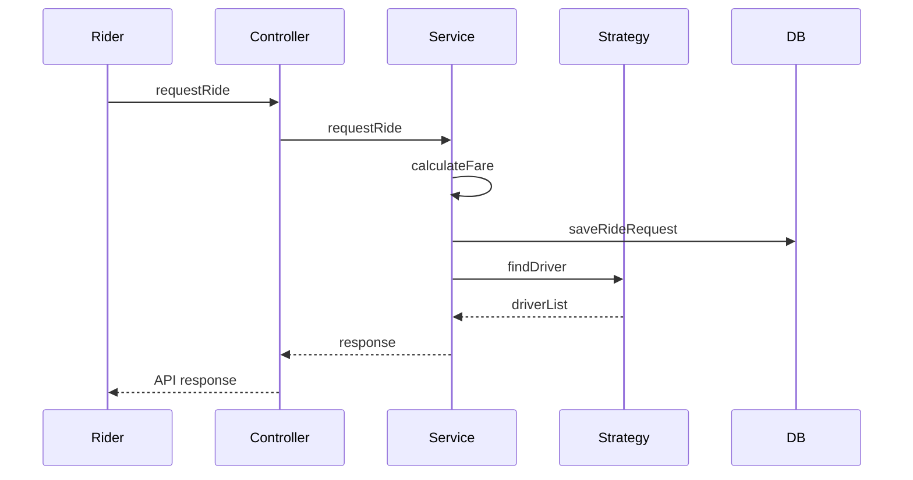
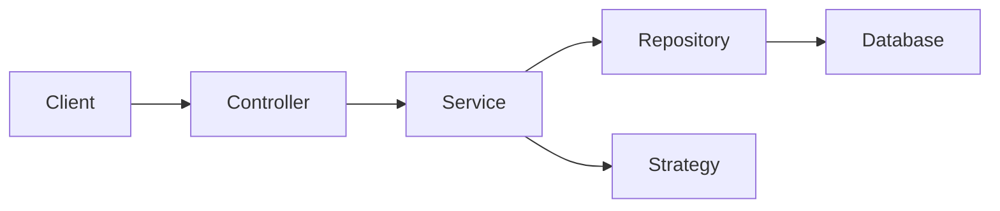
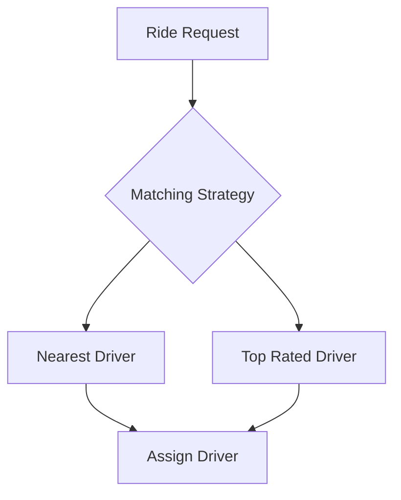
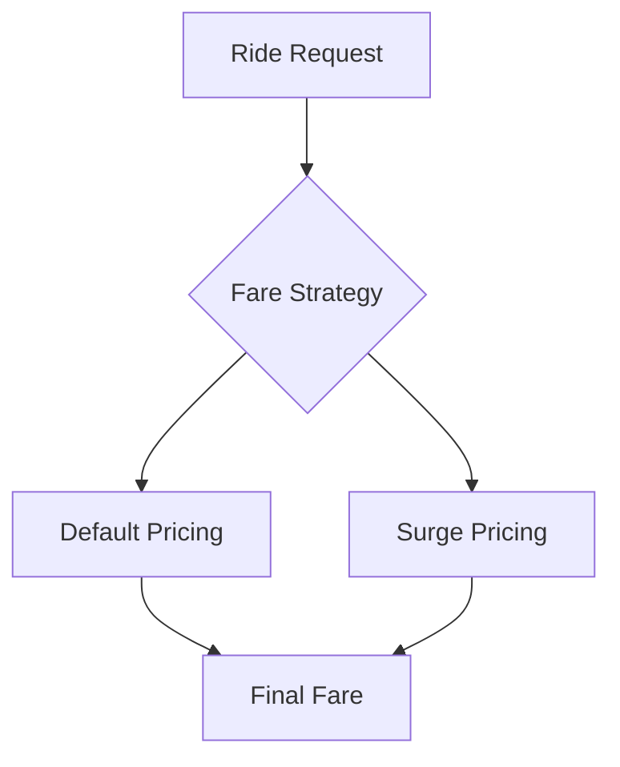

# 🚗 Uber Clone Backend (Spring Boot)

A scalable backend system simulating core functionalities of a ride-hailing platform like Uber.  
Built using Spring Boot with a focus on clean architecture and system design.

---

## 📌 Features

- 🔐 User Signup (Rider onboarding)
- 🚕 Ride Request System
- 📍 Geo-spatial Driver Matching (PostGIS)
- 💰 Dynamic Fare Calculation (Strategy Pattern)
- ⚙️ Pluggable Driver Matching Algorithms
- 🧾 Global API Response & Exception Handling

---

## 🏗️ Tech Stack

- Backend: Spring Boot  
- Database: PostgreSQL + PostGIS  
- ORM: Hibernate / JPA  
- Build Tool: Maven  
- Geo Support: JTS  

---

## 📁 Project Structure

```
src/main/java/com/personal/project/uberClone/uberApp

├── advices
├── configs
├── controllers
├── dto
├── entities
├── exceptions
├── repositories
├── services
├── strategies
├── utils
```

---

## 🔄 Ride Request Flow



---

## 🧠 System Architecture (High-Level)



---

## ⚙️ Driver Matching Logic



---

## 💰 Fare Calculation Strategy



---

## 📍 Geo Query Example

```sql
SELECT d.*, ST_Distance(d.current_location, :pickupLocation) AS distance
FROM drivers d
WHERE d.available = true
AND ST_DWithin(d.current_location, :pickupLocation, 10000)
ORDER BY distance
LIMIT 10;
```

---

## 🔌 API Endpoints

### Auth
POST /auth/signup

### Rider
POST /rider/requestRide

---

## ⚠️ Current Limitations

- Ride lifecycle incomplete  
- No authentication (JWT missing)  
- Driver assignment incomplete  
- Distance service not implemented  
- No concurrency handling  

---

## 🚀 Future Improvements

- Full ride lifecycle  
- JWT authentication  
- Real-time updates  
- Payment integration  
- Driver locking  

---

## 🧪 Run Locally

### Prerequisites
- Java 17+
- Maven
- PostgreSQL + PostGIS

### Steps

```
git clone <your-repo-url>
cd uber-clone
mvn clean install
mvn spring-boot:run
```

---

## 🧑‍💻 Author

Kartik Agrawal  
Backend Developer (Java + Spring Boot)

---

## ⭐ Why This Project Matters

- Demonstrates backend architecture  
- Uses design patterns  
- Implements geo-spatial queries  
- Built for scalability  

---
